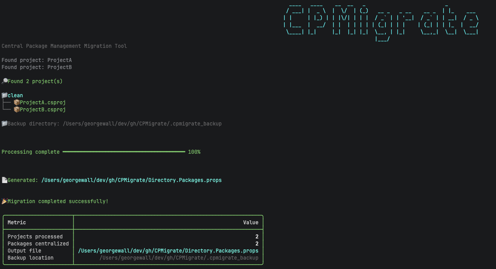
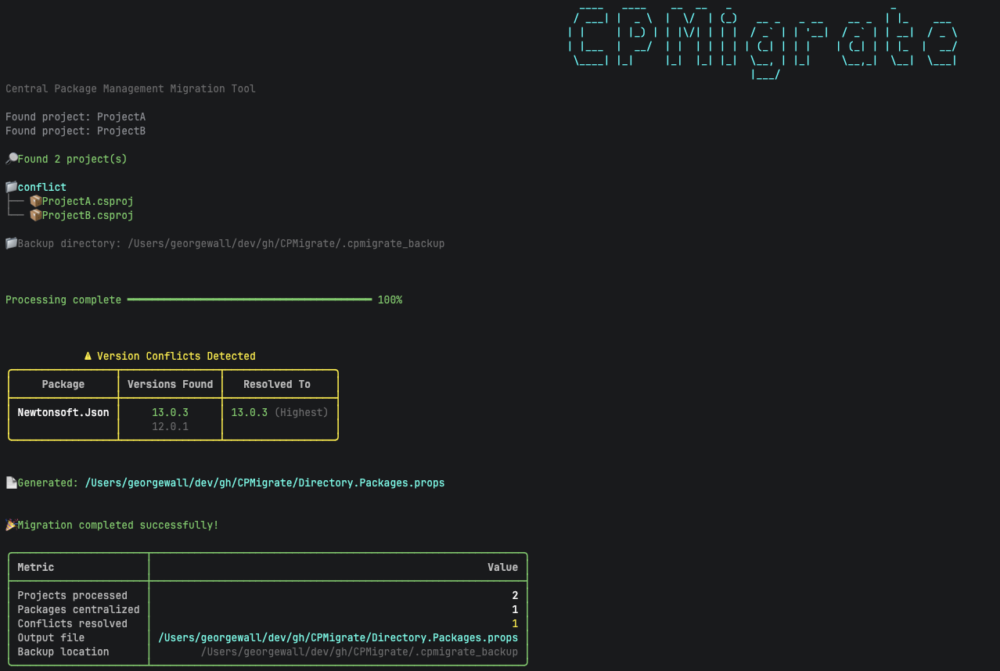
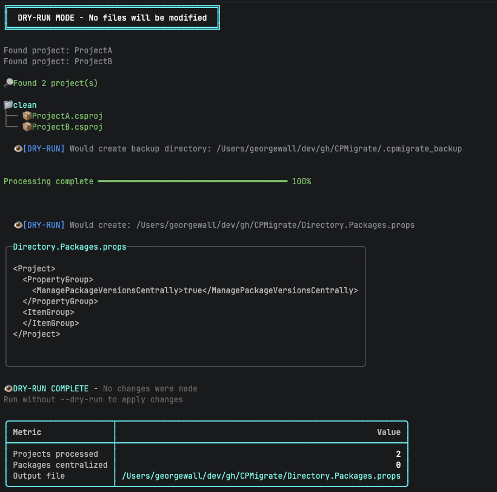

# CPMigrate

A beautiful CLI tool to migrate .NET solutions to [Central Package Management (CPM)](https://learn.microsoft.com/en-us/nuget/consume-packages/central-package-management).


[](https://opensource.org/licenses/MIT)

## Features

- **Automatic Migration** - Scans your solution/projects and generates `Directory.Packages.props`
- **Version Conflict Resolution** - Handles packages with different versions across projects
- **Dry-Run Mode** - Preview changes before applying them
- **Rollback Support** - Undo migrations and restore original project files
- **Beautiful Terminal UI** - Progress bars, colored output, and ASCII art
- **Cross-Platform** - Works on Windows, macOS, and Linux
- **Backup Support** - Automatically backs up project files before modification

## Installation

### As a .NET Global Tool

```bash
dotnet tool install --global CPMigrate
```

### From Source

```bash
git clone https://github.com/georgepwall1991/CPMigrate.git
cd CPMigrate
dotnet build
```

## Testing Locally

To verify the tool works correctly on your machine before installing globally:

```bash
# Pack the tool
dotnet pack CPMigrate/CPMigrate.csproj -o ./nupkg

# Install to a local test path
dotnet tool install CPMigrate --tool-path ./test-tool --add-source ./nupkg

# Run the tool
./test-tool/cpmigrate --help

# Cleanup
rm -rf ./test-tool ./nupkg
```

## Usage

### Basic Usage

```bash
# Migrate current directory (looks for .sln file)
cpmigrate

# Preview changes without modifying files
cpmigrate --dry-run

# Migrate a specific solution
cpmigrate -s /path/to/solution

# Migrate a specific project
cpmigrate -p /path/to/project.csproj
```

### Options

| Option | Short | Description | Default |
|--------|-------|-------------|---------|
| `--solution` | `-s` | Path to solution file or directory | `.` |
| `--project` | `-p` | Path to project file or directory | - |
| `--output-dir` | `-o` | Output directory for Directory.Packages.props | `.` |
| `--dry-run` | `-d` | Preview changes without modifying files | `false` |
| `--rollback` | `-r` | Restore project files from backup and remove Directory.Packages.props | `false` |
| `--keep-attrs` | `-k` | Keep Version attributes in .csproj files | `false` |
| `--no-backup` | `-n` | Disable automatic backup | `false` |
| `--backup-dir` | - | Backup directory location | `.` |
| `--add-gitignore` | - | Add backup directory to .gitignore | `false` |
| `--conflict-strategy` | - | How to handle version conflicts: `Highest`, `Lowest`, or `Fail` | `Highest` |

### Examples

```bash
# Preview migration with dry-run
cpmigrate --dry-run

# Migrate and use lowest version for conflicts
cpmigrate --conflict-strategy Lowest

# Migrate without creating backups
cpmigrate --no-backup

# Migrate and add backup to .gitignore
cpmigrate --add-gitignore

# Rollback a migration (restore original project files)
cpmigrate --rollback

# Rollback with custom backup directory
cpmigrate --rollback --backup-dir ./my-backups
```

## What is Central Package Management?

Central Package Management (CPM) is a NuGet feature that allows you to manage all package versions in a single `Directory.Packages.props` file at the root of your repository, rather than specifying versions in each `.csproj` file.

### Before (Traditional)

```xml
<!-- Project1.csproj -->
<PackageReference Include="Newtonsoft.Json" Version="13.0.1" />

<!-- Project2.csproj -->
<PackageReference Include="Newtonsoft.Json" Version="13.0.1" />
```

### After (CPM)

```xml
<!-- Directory.Packages.props -->
<Project>
  <PropertyGroup>
    <ManagePackageVersionsCentrally>true</ManagePackageVersionsCentrally>
  </PropertyGroup>
  <ItemGroup>
    <PackageVersion Include="Newtonsoft.Json" Version="13.0.1" />
  </ItemGroup>
</Project>

<!-- Project1.csproj -->
<PackageReference Include="Newtonsoft.Json" />

<!-- Project2.csproj -->
<PackageReference Include="Newtonsoft.Json" />
```

## Screenshots


*The main migration interface showing progress bars and status.*


*Automatic detection and resolution of package version conflicts.*


*Dry-run mode previewing changes without modifying files.*

The tool features a beautiful terminal UI with:

- ASCII art header
- Progress bars during migration
- Colored output for different message types
- Tables showing version conflicts and resolution
- Summary statistics after migration

## Contributing

Contributions are welcome! Please feel free to submit a Pull Request.

## License

This project is licensed under the MIT License - see the [LICENSE](LICENSE) file for details.

## Author

**George Wall**

- GitHub: [@georgepwall1991](https://github.com/georgepwall1991)
