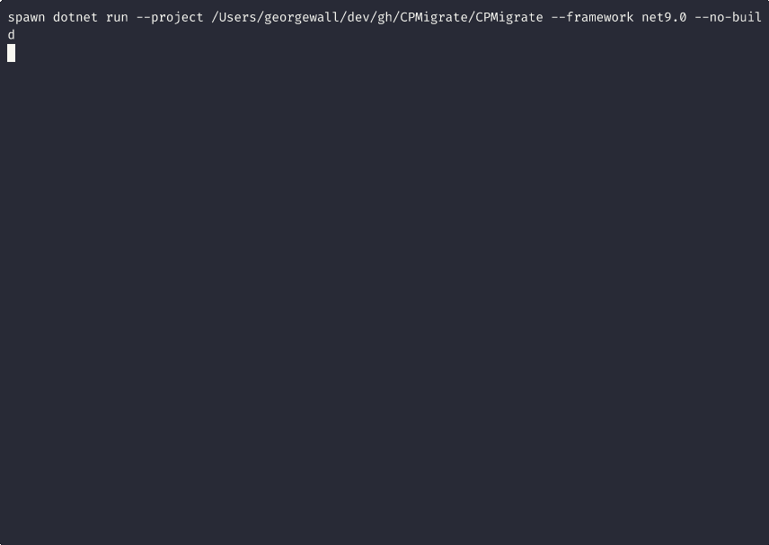

# CPMigrate

A stunning CLI tool to migrate .NET solutions to [Central Package Management (CPM)](https://learn.microsoft.com/en-us/nuget/consume-packages/central-package-management).


[](https://opensource.org/licenses/MIT)
[](https://www.nuget.org/packages/CPMigrate/)



## Features

- **Interactive Wizard Mode** - Guided setup with arrow-key navigation, no flags to remember
- **Automatic Migration** - Scans your solution/projects and generates `Directory.Packages.props`
- **Version Conflict Resolution** - Handles packages with different versions across projects
- **Package Analysis** - Scan for package issues without migrating
- **Dry-Run Mode** - Preview changes before applying them
- **Rollback Support** - Undo migrations and restore original project files
- **Cyberpunk Terminal UI** - Stunning neon-styled interface with progress bars
- **Cross-Platform** - Works on Windows, macOS, and Linux

### New in v2.0

- **JSON Output** - Machine-readable output for CI/CD integration (`--output json`)
- **Config File Support** - Save settings in `.cpmigrate.json` for repeated use
- **Batch Mode** - Migrate multiple solutions in a directory tree (`--batch`)
- **Backup Pruning** - Clean up old backups with retention policies (`--prune-backups`)
- **Quiet Mode** - Suppress progress output for scripts (`--quiet`)

## Installation

### As a .NET Global Tool

```bash
dotnet tool install --global CPMigrate
```

### From Source

```bash
git clone https://github.com/georgepwall1991/CPMigrate.git
cd CPMigrate
dotnet build
```

## Usage

### Interactive Mode (Recommended for New Users)

Simply run `cpmigrate` with no arguments to start the interactive wizard:

```bash
cpmigrate
```

The wizard guides you through:
1. Choosing an operation (Migrate, Analyze, Rollback, or Exit)
2. Selecting your solution file
3. Configuring options with arrow keys
4. Reviewing settings before execution
5. After completion, option to return to main menu or exit

### Command-Line Usage

```bash
# Migrate current directory (looks for .sln file)
cpmigrate -s .

# Preview changes without modifying files
cpmigrate --dry-run

# Migrate a specific solution
cpmigrate -s /path/to/solution

# Migrate a specific project
cpmigrate -p /path/to/project.csproj
```

### Options

#### Core Options

| Option | Short | Description | Default |
|--------|-------|-------------|---------|
| `--interactive` | `-i` | Run in interactive wizard mode | `false` |
| `--solution` | `-s` | Path to solution file or directory | `.` |
| `--project` | `-p` | Path to project file or directory | - |
| `--output-dir` | `-o` | Output directory for Directory.Packages.props | `.` |
| `--dry-run` | `-d` | Preview changes without modifying files | `false` |
| `--rollback` | `-r` | Restore project files from backup | `false` |
| `--analyze` | `-a` | Analyze packages for issues | `false` |
| `--keep-attrs` | `-k` | Keep Version attributes in .csproj files | `false` |
| `--no-backup` | `-n` | Disable automatic backup | `false` |
| `--backup-dir` | - | Backup directory location | `.` |
| `--add-gitignore` | - | Add backup directory to .gitignore | `false` |
| `--conflict-strategy` | - | Version conflicts: `Highest`, `Lowest`, `Fail` | `Highest` |

#### v2.0 Options - Output & CI/CD

| Option | Description | Default |
|--------|-------------|---------|
| `--output` | Output format: `Terminal` or `Json` | `Terminal` |
| `--output-file` | Write JSON output to file instead of stdout | - |
| `--quiet` | Suppress progress bars and spinners | `false` |

#### v2.0 Options - Batch Processing

| Option | Description | Default |
|--------|-------------|---------|
| `--batch` | Scan directory for .sln files and process each | - |
| `--batch-parallel` | Process solutions in parallel | `false` |
| `--batch-continue` | Continue even if one solution fails | `false` |

#### v2.0 Options - Backup Management

| Option | Description | Default |
|--------|-------------|---------|
| `--prune-backups` | Delete old backups, keeping most recent | `false` |
| `--prune-all` | Delete ALL backups (requires confirmation) | `false` |
| `--retention` | Number of backups to keep when pruning | `5` |

### Examples

```bash
# Preview migration with dry-run
cpmigrate --dry-run

# Migrate and use lowest version for conflicts
cpmigrate --conflict-strategy Lowest

# Migrate without creating backups
cpmigrate --no-backup

# Analyze packages for issues without migrating
cpmigrate --analyze

# Rollback a migration
cpmigrate --rollback

# === v2.0 Examples ===

# Output JSON for CI/CD pipelines
cpmigrate --analyze --output json

# Save JSON output to file
cpmigrate --output json --output-file results.json

# Migrate all solutions in a monorepo
cpmigrate --batch /path/to/monorepo

# Batch migrate with continue-on-failure
cpmigrate --batch /path/to/repo --batch-continue

# Clean up old backups, keep last 3
cpmigrate --prune-backups --retention 3

# Delete all backups
cpmigrate --prune-all

# Quiet mode for scripts (no progress bars)
cpmigrate -s . --quiet
```

## Configuration File

Create a `.cpmigrate.json` file in your solution directory to save common settings:

```json
{
  "$schema": "https://raw.githubusercontent.com/georgepwall1991/CPMigrate/main/schemas/cpmigrate.schema.json",
  "conflictStrategy": "Highest",
  "backup": true,
  "backupDir": ".cpmigrate_backup",
  "addGitignore": true,
  "keepVersionAttributes": false,
  "outputFormat": "Terminal",
  "retention": {
    "enabled": true,
    "maxBackups": 5
  }
}
```

CLI options override config file values.

## JSON Output Schema

When using `--output json`, CPMigrate outputs structured JSON:

```json
{
  "version": "2.0.0",
  "operation": "migrate",
  "success": true,
  "exitCode": 0,
  "summary": {
    "projectsProcessed": 5,
    "packagesFound": 42,
    "conflictsResolved": 3
  },
  "conflicts": [...],
  "propsFile": {
    "path": "/path/to/Directory.Packages.props"
  },
  "dryRun": false,
  "timestamp": "2024-01-15T10:30:22Z"
}
```

## What is Central Package Management?

Central Package Management (CPM) is a NuGet feature that allows you to manage all package versions in a single `Directory.Packages.props` file at the root of your repository.

### Before (Traditional)

```xml
<!-- Project1.csproj -->
<PackageReference Include="Newtonsoft.Json" Version="13.0.1" />

<!-- Project2.csproj -->
<PackageReference Include="Newtonsoft.Json" Version="13.0.1" />
```

### After (CPM)

```xml
<!-- Directory.Packages.props -->
<Project>
  <PropertyGroup>
    <ManagePackageVersionsCentrally>true</ManagePackageVersionsCentrally>
  </PropertyGroup>
  <ItemGroup>
    <PackageVersion Include="Newtonsoft.Json" Version="13.0.1" />
  </ItemGroup>
</Project>

<!-- Project1.csproj -->
<PackageReference Include="Newtonsoft.Json" />

<!-- Project2.csproj -->
<PackageReference Include="Newtonsoft.Json" />
```

## Screenshots

### Interactive Wizard Mode


*Interactive wizard with arrow-key navigation - no flags to remember!*

### Migration Mode (CLI)


*Dry-run mode previewing changes with the cyberpunk-styled terminal UI.*

### Package Analysis


*Analyze mode scanning for package issues without modifying files.*

### Terminal UI Features

The tool features a stunning cyberpunk-inspired terminal UI with:

- **Modern "Slant" ASCII Logo** with Deep Pink neon styling
- **Refined Color Palette** featuring Deep Pink, Electric Cyan, and Spring Green
- **Clean Layouts** with framed panels, grids, and rule separators
- **Animated Progress Bars** and spinners for long-running operations
- **Rich Status Icons**: `✔` success, `!` warning, `✖` error, `🚀` migrate
- **Visual Simulation Cues** clearly distinguishing dry-runs from actual execution

## Contributing

Contributions are welcome! Please feel free to submit a Pull Request.

### Regenerating Documentation Media

To regenerate the GIFs and screenshots for the README:

```bash
# Prerequisites
brew install asciinema agg expect

# Generate all documentation media
./scripts/generate-docs-media.sh
```

## License

This project is licensed under the MIT License - see the [LICENSE](LICENSE) file for details.

## Author

**George Wall**

- GitHub: [@georgepwall1991](https://github.com/georgepwall1991)
