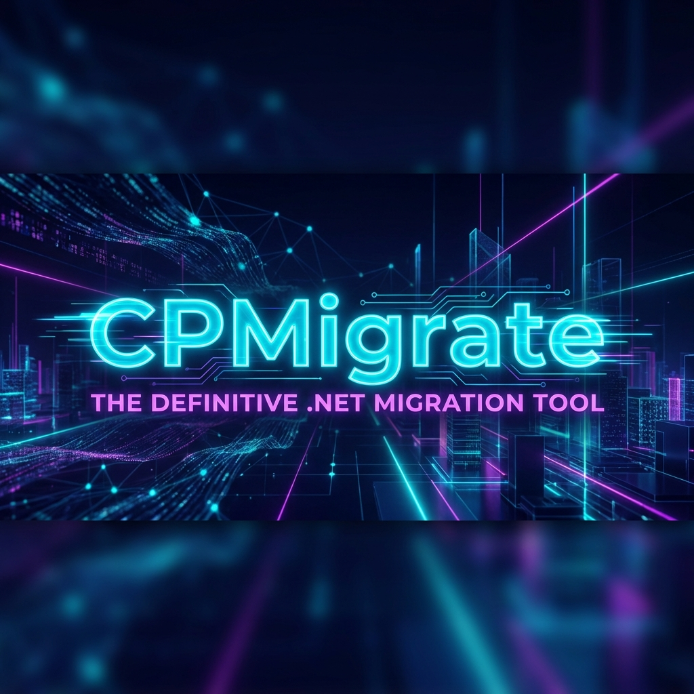

<div align="center">
  
  <br/>
  
</div>

<div align="center">

[](https://dotnet.microsoft.com/)
[](https://opensource.org/licenses/MIT)
[](https://www.nuget.org/packages/CPMigrate/)
[](https://www.nuget.org/packages/CPMigrate/)

</div>


## 🚀 Why CPMigrate?

Managing NuGet versions across dozens of projects is a nightmare of "version drift."
**Central Package Management (CPM)** solves this by unifying versions in a single `Directory.Packages.props` file.

**CPMigrate** automates this transition. It doesn't just move XML around; it **analyzes**, **resolves conflicts**, **cleans up dependencies**, and **secures** your codebase in minutes.

---

## ✨ Features

### 🛡️ Intelligence & Security Suite (New in v2.5)

CPMigrate v2.5+ isn't just a migration tool; it's a repository health auditor.

-   **🔍 Transitive Pinning & Conflict Resolution**
    *   **Problem:** Deep dependency chains often conflict, causing runtime errors.
    *   **Solution:** Automatically detects conflicts deep in the graph and "pins" the correct version at the root level.
-   **🧹 Dependency Lifting (Redundant Reference Removal)**
    *   **Problem:** Projects often explicitly reference packages that are already brought in by other libraries (e.g., `Microsoft.Extensions.Logging`).
    *   **Solution:** Identifies and removes these redundant lines, keeping your `.csproj` files lean.
-   **🚨 Integrated Security Audit**
    *   **Feature:** Runs a real-time vulnerability scan (`dotnet list package --vulnerable`) and integrates findings directly into the migration report.
    *   **Action:** Highlights high-severity CVEs before you lock them into your CPM file.
-   **🎯 Framework Alignment Heatmap**
    *   **Feature:** Visualizes target framework divergence (e.g., mixing `net8.0` and `net472`) which can complicate package resolution.

### 🏗️ Clean Architecture (New in v2.6)

-   **Directory.Build.props Unification**
    *   **Problem:** Repeating `<TargetFramework>`, `<Authors>`, or `<ImplicitUsings>` in every single project file violates DRY.
    *   **Solution:** `cpmigrate --unify-props` automatically detects properties shared by **all** projects, moves them to a solution-level `Directory.Build.props`, and cleans up individual project files.

### 📄 SLNX Solution File Support (New in v2.8)

-   **Modern Solution Format**
    *   **Feature:** Full support for the new `.slnx` XML-based solution file format introduced in Visual Studio 17.10 and .NET SDK 9.0.200+.
    *   **Benefit:** Seamlessly works with both traditional `.sln` and modern `.slnx` files - no configuration needed.
    *   **Reference:** [Introducing SLNX support in .NET CLI](https://devblogs.microsoft.com/dotnet/introducing-slnx-support-dotnet-cli/)

### 🔒 Enhanced Security & Hardening (New in v2.9)

-   **Secure Execution Pipeline**
    *   **Feature:** Mitigated PATH injection vulnerabilities by strictly resolving the absolute path of the `dotnet` host process.
    *   **Benefit:** Ensures that `cpmigrate` cannot be tricked into executing malicious binaries named `dotnet` placed in writable directories.
-   **Hardened CI/CD Supply Chain**
    *   **Feature:** Pinned GitHub Actions dependencies to specific SHA hashes and implemented secure secret injection via environment variables.
    *   **Benefit:** Protects the build pipeline against upstream compromised actions and prevents secret leakage in logs.

### 🎮 Mission Control Dashboard

-   **Zero-Typing Interface:** Navigate your file system and options using only arrow keys.
-   **Risk Assessment:** Pre-scans your repo to calculate a "Migration Risk" score based on version divergence.
-   **Live Verification:** Automatically runs `dotnet restore` after every major change to ensure build integrity.
-   **Cyberpunk UI:** A stunning, high-density terminal interface with progress blueprints and real-time status updates.

---

## 📦 Installation

### As a .NET Global Tool (Recommended)

Requires .NET SDK 8.0 or later (supports .NET 10).

```bash
dotnet tool install --global CPMigrate
```

**Upgrading to the latest version:**

```bash
dotnet tool update --global CPMigrate
```

> **Note:** If you just released a version, NuGet indexing might take ~15 minutes. Try clearing your cache if updates aren't finding the new version:
> `dotnet nuget locals http-cache --clear`

### From Source

```bash
git clone https://github.com/georgepwall1991/CPMigrate.git
cd CPMigrate
dotnet build
```

---

## 🕹️ Usage

### Interactive Mode (The "Mission Control")

Simply run the command without arguments to enter the wizard:

```bash
cpmigrate
```

The tool will:
1.  **Scan** for solutions and git status.
2.  **Dashboard** your current repository state.
3.  **Guide** you through migration, cleanup, or analysis.

### Command-Line (CI/CD & Power Users)

**Migrate the current folder's solution:**
```bash
cpmigrate -s .
```

**Unify common properties to Directory.Build.props:**
```bash
cpmigrate --unify-props
```

**Dry-run (Preview changes):**
```bash
cpmigrate --dry-run
```

**Analyze and auto-fix issues (No migration, just cleanup):**
```bash
cpmigrate --analyze --fix
```

**Batch migrate an entire monorepo:**
```bash
cpmigrate --batch /path/to/repo --batch-parallel
```

### Options Reference

| Option | Short | Description |
|--------|-------|-------------|
| `--interactive` | `-i` | Launch the Mission Control TUI (Default if no args). |
| `--solution` | `-s` | Path to `.sln` or `.slnx` file or directory. |
| `--unify-props` | - | Migrate common project properties to `Directory.Build.props`. |
| `--dry-run` | `-d` | Simulate operations without writing files. |
| `--analyze` | `-a` | Run health checks (duplicates, security, transitive). |
| `--fix` | - | Apply automatic fixes to discovered analysis issues. |
| `--rollback` | `-r` | Restore the last backup state. |
| `--prune-backups` | - | Clean up old backup files to save space. |
| `--output` | - | Output format: `Terminal` (default) or `Json` (for CI pipes). |

---

## 🖼️ Gallery

### Mission Control Dashboard

*The state-driven dashboard assessing migration risk.*

### Risk Analysis & Dry Run

*Previewing massive changes safely before committing.*

### Security & Package Analysis

*Scanning for vulnerabilities and redundant dependencies.*

---

## 🤝 Contributing

Contributions are what make the open-source community such an amazing place to learn, inspire, and create. Any contributions you make are **greatly appreciated**.

1.  Fork the Project
2.  Create your Feature Branch (`git checkout -b feature/AmazingFeature`)
3.  Commit your Changes (`git commit -m 'Add some AmazingFeature'`)
4.  Push to the Branch (`git push origin feature/AmazingFeature`)
5.  Open a Pull Request

---

## 📄 License

Distributed under the MIT License. See `LICENSE` for more information.

## 👤 Author

**George Wall**
-   GitHub: [@georgepwall1991](https://github.com/georgepwall1991)